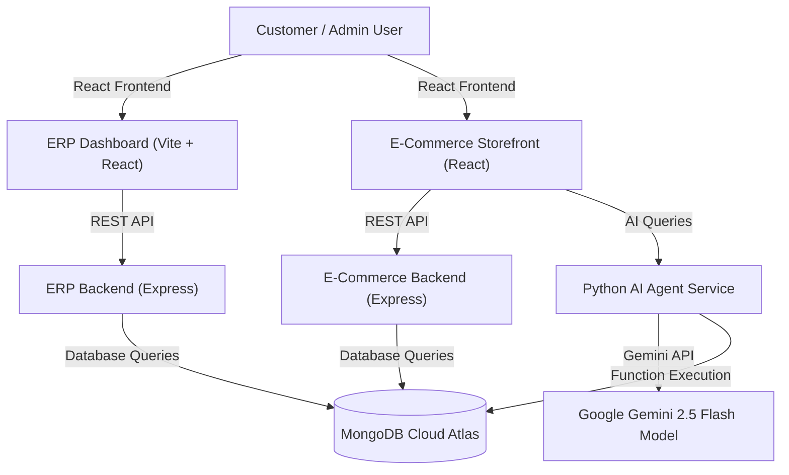

# 🚀 Cognivio | AI-Powered ECO-ERP System & MERN E-Commerce Platform


**Cognivio** is a next-generation Enterprise Resource Planning (ERP), CRM, and E-Commerce platform integrated with an **Autonomous AI Agentic Microservice**. Built using the MERN stack (MongoDB, Express, React, Node.js) and Python, Cognivio provides real-time business intelligence, automated inventory management, revenue forecasting, dynamic pricing, and an intelligent AI shopping assistant.

---

## 🌟 Key Features

### 🤖 Autonomous Agentic AI Service
* **Grounded Tool Calling**: Operates using Google Gemini API (`gemini-2.5-flash`) via an OpenAI-compatible function-calling engine.
* **Smart Shopping Assistant**: Identifies user intents, adds products to cart, queries stock availability, and checks order status.
* **Business Intelligence Queries**: Returns live customer counts, total revenue summaries, and real-time employee attendance data.
* **Predictive Forecasting & Dynamic Pricing**: Calculates dynamic pricing based on market demand/competitor prices and projects linear revenue trends.

### 🏢 ERP & CRM Management (`ERP-SYSTEM`)
* **Real-time Business Dashboard**: Revenue analytics, monthly invoice summaries, active inventory stock, and employee attendance metrics.
* **Customer & Lead Management**: Centralized client profiles, order history, shipping details, and interaction tracking.
* **HR & Payroll**: Employee directories, attendance tracking, and automated payroll processing.
* **Financial Management**: Automated PDF invoice generation, expense categorization, and payment mode logging.

### 🛍️ Full-Featured E-Commerce Storefront (`mern-ecommercee`)
* **Product Catalog & Recommendations**: Responsive product grid with search filtering, stock status, and AI-driven recommendations.
* **Cart & Seamless Checkout**: Persistent cart management, shipping address selection, and order placement.
* **Integrated AI Chat Widget**: Floating conversational bot embedded directly into the storefront.

---

## 🏗️ System Architecture



---

## 📁 Repository Structure

```text
FINAL-YEAR-PROJECT/
├── AI-SERVICE/                 # Python Agentic AI Microservice
│   ├── main.py                 # HTTP Server, Gemini LLM agent, tool calling handlers
│   ├── seed_knowledge.py       # Knowledge base database seeder script
│   └── requirements.txt        # Python dependencies (scikit-learn, pymongo, openai)
│
├── ERP-SYSTEM/                 # Enterprise Resource Planning & CRM
│   ├── backend/                # Express API Server (Models: Admin, Client, Employee, Invoice, etc.)
│   └── frontend/               # React + Vite Dashboard with Ant Design UI components
│
└── mern-ecommercee/            # Customer-facing E-Commerce Application
    ├── backend/                # Express API Server (User Auth, Orders, Products, Cart)
    └── frontend/               # React Storefront with embedded Cognivio AI Chatbot
```

---

## 🛠️ Technology Stack

| Layer | Technologies Used |
| :--- | :--- |
| **Frontend** | React.js, Vite, Redux Toolkit, Ant Design (AntD), Material UI, Framer Motion, Axios |
| **Backends** | Node.js, Express.js, Mongoose, JWT Authentication, Bcrypt |
| **AI / Microservices** | Python 3, Google Gemini API, OpenAI SDK compatibility layer, Scikit-Learn, PyMongo |
| **Database** | MongoDB Cloud Atlas (Shared collections for unified ERP and E-Commerce state) |
| **Deployment** | Vercel (Frontends), Render (Node Backends & Python AI Microservice) |

---

## ⚡ Quick Start & Local Setup

### 1. Prerequisites
* **Node.js** (v18+ or v20+)
* **Python** (v3.10+)
* **MongoDB** (Local instance or MongoDB Atlas URI)

### 2. Environment Variables Setup

Create a `.env` file in each directory:

#### `AI-SERVICE/.env`
```env
GEMINI_API_KEY=your_gemini_api_key
MONGO_URI=your_mongodb_connection_string
```

#### `ERP-SYSTEM/backend/.env`
```env
DATABASE=your_mongodb_connection_string
JWT_SECRET=your_jwt_secret_key
ERP_INTERNAL_KEY=supersecret123
```

#### `mern-ecommercee/backend/.env`
```env
MONGO_URI=your_mongodb_connection_string
SECRET_KEY=your_secret_key
ERP_INTERNAL_KEY=supersecret123
```

---

### 3. Running Services Locally

Open separate terminal windows for each service:

```bash
# Terminal 1: Run AI Service
cd AI-SERVICE
python main.py

# Terminal 2: Run ERP Backend
cd ERP-SYSTEM/backend
npm install
npm run dev

# Terminal 3: Run ERP Frontend
cd ERP-SYSTEM/frontend
npm install
npm run dev

# Terminal 4: Run E-Commerce Backend
cd mern-ecommercee/backend
npm install
npm run dev

# Terminal 5: Run E-Commerce Frontend
cd mern-ecommercee/frontend
npm install
npm start
```

---

## 🚀 Deployment Guide

### Deploying Backends & AI Service on Render
1. **ERP Backend (`ERP-SYSTEM/backend`)**:
   * **Root Directory**: `ERP-SYSTEM/backend`
   * **Build Command**: `npm install`
   * **Start Command**: `npm start`
2. **Python AI Service (`AI-SERVICE`)**:
   * **Root Directory**: `AI-SERVICE`
   * **Build Command**: `pip install -r requirements.txt`
   * **Start Command**: `python main.py`
3. **E-Commerce Backend (`mern-ecommercee/backend`)**:
   * **Root Directory**: `mern-ecommercee/backend`
   * **Build Command**: `npm install`
   * **Start Command**: `npm start`

### Deploying Frontends on Vercel
1. **ERP Dashboard (`ERP-SYSTEM/frontend`)**:
   * **Root Directory**: `ERP-SYSTEM/frontend`
   * **Framework Preset**: Vite
2. **E-Commerce Storefront (`mern-ecommercee/frontend`)**:
   * **Root Directory**: `mern-ecommercee/frontend`
   * **Framework Preset**: Create React App
   * **Environment Variable**: `CI=false`

---

## 📝 License

This project is created for educational and final-year project demonstration purposes.
